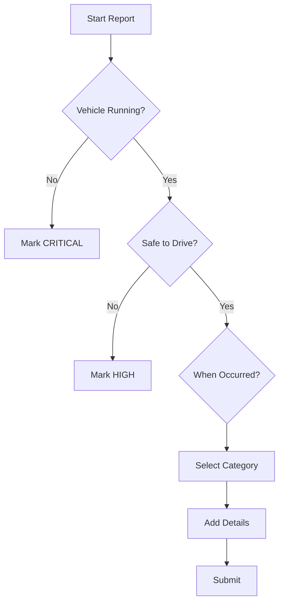
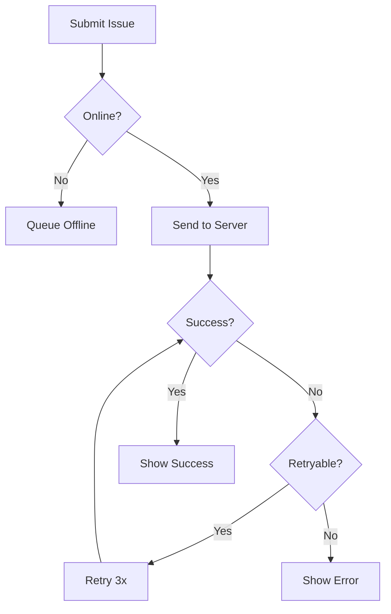

# Driver-Ready System Enhancement

## Overview

This design enhances the SE Repairs fleet management system to optimize the driver experience across all touchpoints. The focus is on making the system intuitive, efficient, and production-ready for drivers in the field, while improving reliability, accessibility, and usability throughout the entire platform.

## Strategic Objectives

- Streamline the driver workflow for faster issue reporting
- Enhance mobile experience for field operations
- Improve driver visibility into issue status and updates
- Strengthen offline capabilities for remote locations
- Optimize performance for drivers on limited connectivity
- Provide clear guidance and better error handling

## Driver Experience Improvements

### Enhanced Issue Reporting Flow

#### Simplified Quick Report Mode
Provide a streamlined reporting path for common scenarios:

| Field | Enhancement |
|-------|-------------|
| Vehicle Selection | Recent vehicles appear first, search-as-you-type filtering |
| Issue Category | Show visual icons, group by frequency, suggest based on vehicle type |
| Description | Provide templates for common issues, voice-to-text support |
| Media Upload | Bulk photo capture, compress automatically, preview before upload |

#### Smart Auto-Complete
Enhance existing auto-fill with predictive capabilities:

- Remember driver's last used vehicle
- Pre-populate based on GPS location matching depot
- Suggest category based on description keywords
- Auto-detect severity from description patterns (e.g., "stopped", "unsafe" → HIGH)

#### Guided Reporting Assistant
Multi-step wizard for new or uncertain drivers:

### Driver Dashboard

#### My Issues View
Dedicated driver-centric page to track all their submissions:

| Section | Purpose |
|---------|---------|
| Active Issues | Current open reports with status badges |
| Scheduled Repairs | Upcoming workshop appointments with countdown |
| Completed History | Past 30 days resolved issues |
| Draft Reports | Auto-saved incomplete reports (offline support) |

#### Status Visibility
Clear, visual status indicators drivers can understand:

| Status | Driver-Friendly Label | Icon | Description |
|--------|----------------------|------|-------------|
| PENDING | Reported | Clock | Workshop team reviewing |
| IN_PROGRESS | Being Fixed | Wrench | Mechanic working on it |
| SCHEDULED | Appointment Booked | Calendar | Repair scheduled for [date] |
| COMPLETED | Fixed | Check | Ready for pickup |

#### Real-Time Notifications
Push notifications for status changes:

- Issue acknowledged by operations
- Mechanic assigned to repair
- Repair scheduled with date/time
- Vehicle ready for collection
- Request for additional information

### Mobile Optimization

#### Progressive Web App (PWA) Enhancements
Transform the existing responsive site into a full-featured PWA:

| Capability | Implementation Strategy |
|------------|-------------------------|
| Install Prompt | Show "Add to Home Screen" banner after first successful report |
| App Icon | SE Repairs branded icon on device home screen |
| Splash Screen | Professional loading screen with company branding |
| Offline Mode | Enhanced IndexedDB storage for forms, fleet data, and recent issues |
| Push Notifications | Web Push API for status updates even when app closed |

#### Touch-Optimized Interface
Improve mobile interactions:

- Larger tap targets (minimum 44x44px)
- Swipe gestures for navigation
- Bottom sheet modals for easier thumb reach
- Sticky submit button visible while scrolling
- Haptic feedback on important actions

#### Camera Integration
Optimize photo capture workflow:

- Direct camera access (no file picker on mobile)
- Multiple rapid-fire photo capture
- Auto-rotate and EXIF preservation
- Client-side image compression before upload
- Preview gallery with delete option

### Offline Capabilities Enhancement

#### Expanded Offline Storage
Extend existing IndexedDB implementation:

| Data Type | Storage Strategy | Sync Strategy |
|-----------|------------------|---------------|
| Fleet Mappings | Cache with 24-hour TTL | Background refresh when online |
| Draft Reports | Indefinite until submitted | Auto-submit with retry queue |
| Recent Issues | Driver's last 10 issues | Pull latest on app open |
| Media Files | Base64 encode small images | Upload when online, queue large files |

#### Offline Indicator Enhancements
Improve existing offline awareness:

- Persistent banner showing offline mode
- Display last data sync timestamp
- Show queue count with expandable details
- Manual retry button for failed syncs
- Network quality indicator (3G/4G/WiFi)

#### Conflict Resolution
Handle edge cases when submitting stale offline data:

- Timestamp all offline submissions
- Detect if fleet data changed while offline
- Prompt driver to review auto-filled data before final submit
- Log discrepancies for operations review

## Accessibility Improvements

### WCAG 2.1 AA Compliance

#### Visual Accessibility
Ensure all drivers can use the system regardless of vision:

| Requirement | Implementation |
|-------------|----------------|
| Color Contrast | Minimum 4.5:1 for normal text, 3:1 for large text |
| Text Sizing | Support browser zoom up to 200% without breaking layout |
| Focus Indicators | Clear blue outline on all interactive elements |
| Error States | Red text with accompanying icons, not color alone |

#### Screen Reader Support
Full keyboard navigation and ARIA labels:

- Semantic HTML5 elements (nav, main, section, article)
- ARIA labels on all icons and controls
- Live regions for dynamic status updates
- Announced validation errors
- Descriptive link text (avoid "click here")

#### Multilingual Support
Leverage existing translation infrastructure:

- Expand English/Punjabi dictionary coverage
- Add Vietnamese, Mandarin based on driver demographics
- Auto-detect browser language preference
- Persistent language selection
- Right-to-left (RTL) layout support for future languages

### Input Assistance

#### Form Validation Improvements
Enhanced validation with helpful messaging:

| Field | Validation | Helpful Error Message |
|-------|-----------|----------------------|
| Driver Phone | Format check | "Enter 10 digits or +61 format" |
| Description | Min 10 characters | "Add a few more details to help the workshop (X/10 characters)" |
| Fleet Number | Match database | "Not found. Try selecting from list or contact operations" |
| Date/Time | Future dates only | "Preferred time should be in the future" |

#### Smart Input Features
Reduce driver typing burden:

- Phone number auto-formatting as they type
- Registration plate uppercase transformation
- GPS coordinates with copy-paste support
- Description spell-check enabled
- Auto-save every 30 seconds

## Performance Optimizations

### Loading Speed Improvements

#### Initial Page Load
Target: Report page loads in under 2 seconds on 3G:

| Optimization | Strategy |
|--------------|----------|
| Code Splitting | Lazy load upload component, calendar picker |
| Image Optimization | WebP format, responsive srcset |
| Font Loading | Subset fonts, preload critical fonts |
| Critical CSS | Inline above-fold styles |
| Service Worker | Cache static assets aggressively |

#### Runtime Performance
Smooth 60fps interactions:

- Debounce search inputs (300ms)
- Virtualize long lists (issues, fleet dropdowns)
- Memoize expensive calculations
- Use CSS transforms for animations
- Lazy render off-screen components

### Data Efficiency

#### API Response Optimization
Reduce payload sizes:

| Endpoint | Optimization |
|----------|--------------|
| GET /api/mappings | Gzip compression, only send active records |
| POST /api/issues | Accept compressed images |
| GET /api/issues | Pagination, limit fields returned |

#### Caching Strategy
Minimize redundant network requests:

- Mappings cached in localStorage (existing)
- HTTP cache headers for static assets (1 year)
- ETag support for conditional requests
- Prefetch driver's recent issues on login
- Background sync for non-urgent updates

## Error Handling and Reliability

### Graceful Degradation

#### Network Errors
User-friendly error recovery:

#### Error Messages
Clear, actionable error communication:

| Error Type | User Message | Action |
|------------|--------------|--------|
| Network Failure | "Can't reach server. Report saved and will submit automatically." | Queue offline |
| Validation Error | "Please check: [specific fields]" | Highlight fields |
| File Too Large | "Photo is 12MB. Max is 10MB. Try reducing quality." | Show compression option |
| Rate Limited | "Too many requests. Please wait 1 minute." | Show countdown timer |

### Data Integrity

#### Form State Preservation
Never lose driver's work:

- Auto-save draft every 30 seconds
- Restore draft on page refresh
- Warn before navigating away with unsaved changes
- Survive browser crash via localStorage
- Multi-device draft sync (future enhancement)

#### Upload Reliability
Ensure media doesn't get lost:

- Chunk large files for resumable uploads
- Retry failed uploads with exponential backoff
- Store upload queue in IndexedDB
- Visual progress indicator
- Fallback to smaller resolution if repeated failures

## User Guidance and Support

### In-App Help

#### Contextual Tooltips
Provide help exactly where needed:

| Element | Tooltip Content |
|---------|-----------------|
| Safe to Continue field | "If vehicle is unsafe, mark 'No' and call operations immediately" |
| Severity selector | "High/Critical gets priority. Choose based on urgency" |
| GPS button | "Capture your exact location automatically" |
| Auto-fill button | "Pull phone and registration from your previous entries" |

#### Onboarding Flow
First-time driver tutorial (dismissible):

1. Welcome screen with system overview
2. Quick tour of report form (3-4 highlights)
3. Show them how to track issues
4. Explain offline mode capability
5. Bookmark/save the page prompt

### Status Communication

#### Clear Feedback
Immediate confirmation for all actions:

| Action | Feedback |
|--------|----------|
| Issue Submitted | Green toast: "Report #12345 submitted successfully" |
| Offline Queue | Amber banner: "Saved offline. Will submit when connected." |
| Media Uploaded | Progress bar with "3 of 5 photos uploaded" |
| Auto-save | Subtle indicator: "Draft saved 30s ago" |

#### Timeline View
Show issue lifecycle to drivers:

Each step shows timestamp and responsible party.

## Analytics and Monitoring

### Driver Behavior Insights

Track metrics to improve experience:

| Metric | Purpose |
|--------|---------|
| Time to Complete Report | Identify friction points, optimize flow |
| Offline Submission Rate | Gauge offline reliability needs |
| Photo Upload Success | Detect upload issues, compression effectiveness |
| Form Abandonment | Where drivers drop off, improve those sections |
| Error Frequency | Common validation failures, improve messaging |

### Performance Monitoring

Real User Monitoring (RUM) for drivers:

- Page load time by network type (3G/4G/WiFi)
- Time to interactive on report form
- API response times by endpoint
- Error rate and types
- Device and browser distribution

## Security and Privacy

### Driver Data Protection

#### Sensitive Information Handling
Protect driver PII:

| Data Type | Protection Measure |
|-----------|-------------------|
| Phone Numbers | Masked in logs, encrypted in transit |
| GPS Coordinates | Optional field, truncated precision |
| Photos | EXIF location stripped before storage |
| Driver Name | No autocomplete on shared devices |

#### Session Management
Secure but convenient authentication:

- Auto-logout after 8 hours inactivity
- "Remember me" option for personal devices
- Session invalidation on password change
- Clear session data on logout
- Warn if multiple active sessions detected

## Implementation Priorities

### Phase 1: Critical Driver Experience (Week 1-2)
1. Mobile PWA enhancements (install prompt, splash screen)
2. Driver dashboard "My Issues" page
3. Enhanced status visibility with friendly labels
4. Improved offline error handling
5. Form auto-save and draft restoration

### Phase 2: Usability and Accessibility (Week 3-4)
6. Quick report mode with templates
7. Smart auto-complete and prediction
8. WCAG 2.1 AA compliance audit and fixes
9. Multilingual expansion (add Vietnamese)
10. Touch-optimized controls and gestures

### Phase 3: Performance and Reliability (Week 5-6)
11. Code splitting and lazy loading
12. Image compression and optimization
13. Caching strategy implementation
14. Chunked file uploads with retry
15. Real User Monitoring setup

### Phase 4: Polish and Guidance (Week 7-8)
16. Onboarding tutorial flow
17. Contextual help tooltips
18. Issue timeline visualization
19. Push notification implementation
20. Analytics dashboard for driver metrics

## Success Criteria

### Quantitative Metrics
- Report submission time reduced by 40% (from average 5min to 3min)
- Mobile traffic increases to 80%+ of total usage
- Offline submission success rate above 95%
- Page load time under 2s on 3G
- Zero data loss incidents

### Qualitative Indicators
- Drivers can submit reports without training
- Reduction in "how do I" support calls
- Positive feedback on status visibility
- Increased adoption of PWA home screen installation
- Workshop staff report higher quality issue descriptions

## Technical Considerations

### Browser Compatibility
Support matrix for driver devices:

| Browser | Version | Notes |
|---------|---------|-------|
| Chrome Android | Last 2 versions | Primary target |
| Safari iOS | Last 2 versions | PWA limitations noted |
| Samsung Internet | Latest | Common on company devices |
| Firefox Android | Latest | Full feature parity |

### Backward Compatibility
Maintain existing functionality:

- All current API endpoints remain unchanged
- Operations and Workshop interfaces unaffected
- Existing offline queue continues working
- Database schema additions only (no breaking changes)

### Scalability
Design for growth:

- Support 500+ concurrent drivers
- Handle 1000+ reports per day
- Store 10GB+ media per month
- Maintain performance with 50,000+ historical issues

## Dependencies and Risks

### Technical Dependencies
- Service Worker API for PWA features
- Push API for notifications (requires HTTPS)
- IndexedDB for offline storage
- FileReader API for image compression

### Risk Mitigation

| Risk | Mitigation |
|------|------------|
| iOS PWA limitations | Provide native app alternative in future |
| Large file uploads fail | Implement chunking and compression |
| Offline sync conflicts | Timestamp and manual review workflow |
| Browser incompatibility | Progressive enhancement, feature detection |

## Future Enhancements

Post-initial release considerations:

- Voice-to-text description input
- Barcode scanning for parts identification
- Integration with telematics for auto-reporting
- Driver performance dashboard
- Gamification for complete reporting
- Native mobile apps (iOS/Android)
- SMS status updates for drivers without smartphones
- Integration with driver scheduling systems
